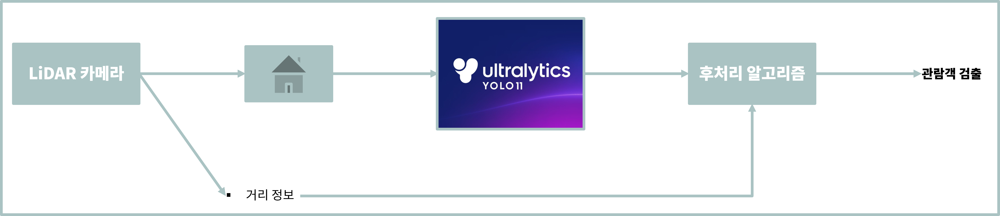
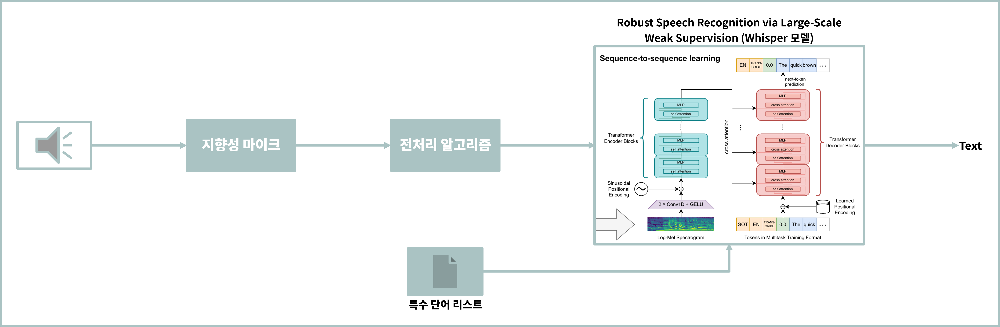
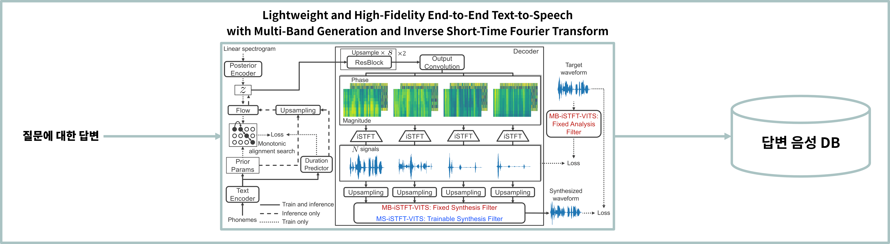

# AI Digital Human — 보훈인물 인터랙티브 콘텐츠 플랫폼

> 역사적 인물을 디지털로 복원하여 기념관 방문객과 상호작용 가능한 AI 디지털 휴먼 플랫폼 개발
> 기간: 2023.08 – 2023.12 | Repo: github.com/fly4hyun/digital-human

---

## Summary

* 김구·안중근·윤봉길 3인을 대상으로 **대화형 AI 디지털 휴먼** 구축
* 관람객 인식(카메라+LiDAR) → STT(Whisper) → 답변 → TTS(VITS2+MB‑iSTFT) 일관 파이프라인 설계
* 국가보훈부 플랫폼/기념관에서 체험 가능한 수준까지 개발

---

## My Scope (내 담당 구간)

* **관람객 인식** — 카메라+LiDAR 기반 사람 검출 및 거리 판정 로직 + API 제공
* **STT(Whisper)** — Prompt 최적화·특수단어 사전 2,044개 주입·대화 시작/종료 감지
* **TTS(VITS2+MB‑iSTFT)** — 성우 녹음코퍼스 학습 및 응답 음성 사전생성

(※ QA/3D모델링/전시연출은 타부서/타업체 수행)

---

## Pipeline

1. **Visitor Detection**

   * RGB 인물검출 + LiDAR 거리범위 결합 → "대화 가능 상태" 판정

2. **STT (Whisper)**

   * 지향성 마이크 전처리 + 파라미터 튜닝으로 노이즈 억제
   * 보훈 관련 단어 사전 2,044개 삽입하여 인식률 개선
   * 발화 종료 시점 탐지 후 메인 프로세스 전달

3. **TTS (MB‑iSTFT‑VITS2)**

   * 보훈인물 톤에 맞는 성우 데이터로 학습
   * 지연 최소화를 위해 예상응답을 사전 합성·DB 캐싱

---

## Result

* 관람객 인식·STT·TTS **3개 핵심 모듈을 통합**하여 실전 전시수준 데모 완료
* 국가보훈부 플랫폼/기념관에서 **일부 전시 적용·체험 가능 상태로 납품**

---

## Image Assets

### 1) 관람객 인식 (LiDAR + YOLO)

  

### 2) 마이크 전처리 + Whisper + 특수단어 사전

  

### 3) TTS 생성 및 DB 사전 저장 파이프라인

  

### 4) 전시장/홈페이지 설치 사진

  

